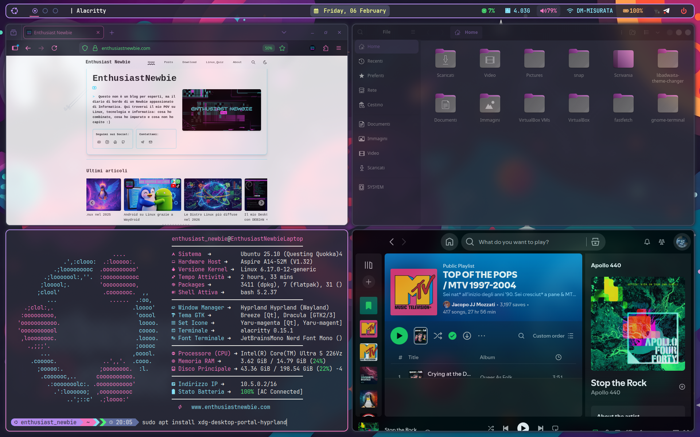
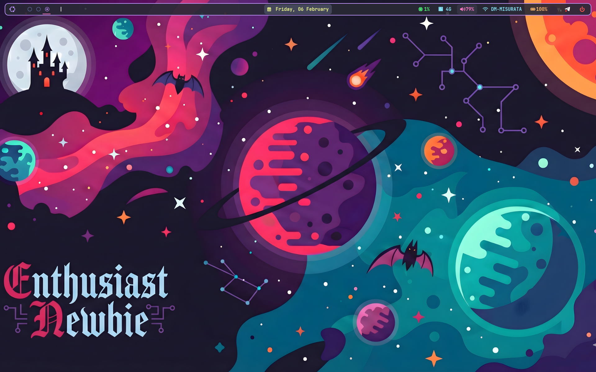
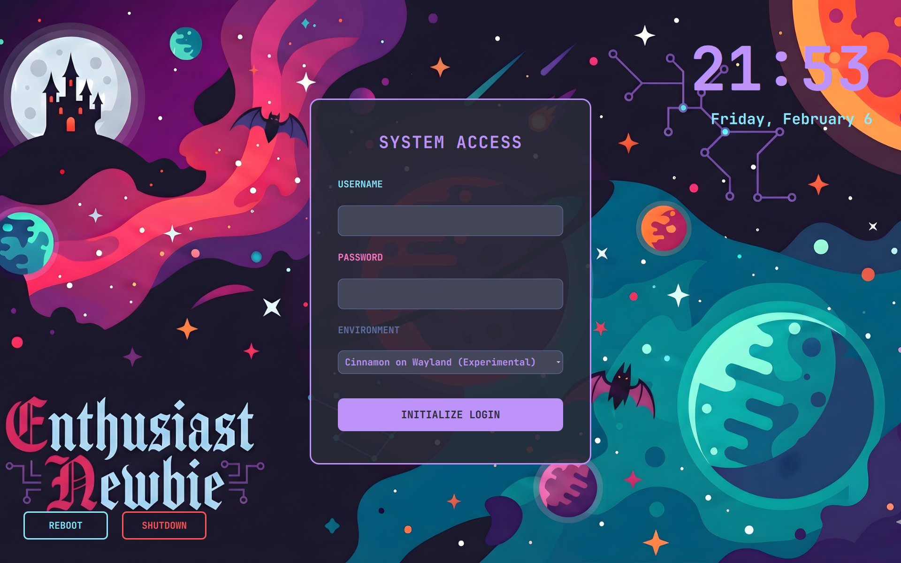

# 🧛 Dracula_Newbie_Theme_Hyprland - Ubuntu Edition



*Questo repository contiene il setup completo **Dracula_Newbie** per Hyprland su Ubuntu.*
È un insieme di dotfiles che ho creato per rendere il mio Desktop coerente al mio tema preferito ..
* ..Ispirato quindi alla palette [Dracula Theme](https://draculatheme.com/).


 
A differenza di Arch Linux, Ubuntu richiede alcuni "trick" specifici per gestire correttamente i permessi, i portali e SDDM (Specialmente visto che utilizza una versione di Hyprland abbastanza outdatata rispetto alla freschissima versione di Arch). Nei commenti all'interno dei dotfiles, ho cercato di mettere in evidenza tutte le differenze che ho trovato.

## 📂 Struttura del Repo
* **`hypr/`**: Core config (Hyprland, Paper, Lock, Idle).
* **`waybar/`**: Barra superiore con moduli custom e CSS Dracula.
* **`Dracula_Newbie_Theme_Sddm/`**: Tema di login personalizzato .
* **`alacritty/`**: Configurazione del terminale.
* **`wofi/` & `dunst/`**: Launcher e sistema di notifiche.
* **`starship/` & `fastfetch/`**: Estetica della shell.

---


##  Fase 1: Installazione Software

Installa il cuore del setup e le utility necessarie per audio, bluetooth e luminosità:

```bash
# Compositor e Interfaccia
sudo apt install hyprland hyprpaper waybar wofi alacritty dunst xdg-desktop-portal-hyprland

# Audio, Bluetooth e Utility
sudo apt install pipewire wireplumber pavucontrol pamixer blueman brightnessctl network-manager-gnome starship fastfetch fonts-font-awesome

# Polkit (FONDAMENTALE: senza questo le app non chiederanno mai la password e non si apriranno)
sudo apt install policykit-1-gnome
# Font e Icone ( Senza dei Fonts adatti Waybar e Starship mostreranno solo simboli rotti.)
sudo apt install fonts-jetbrains-mono
# Ti consiglio anche di installare la versione "Jetbrains Mono Nerd" da qui: https://www.nerdfonts.com/font-downloads
```

---

## Fase 2: Installazione Dotfiles

Sposta i file nella tua home:

```bash
git clone [https://github.com/EnthusiastNewbie/MyLab.git](https://github.com/EnthusiastNewbie/MyLab.git)
cd MyLab
cd Dracula_Newbie_Theme_Hyprland

# Copia le configurazioni nella cartella .config
cp -r alacritty dunst fastfetch hypr starship waybar wofi ~/.config/

# Rendi eseguibili gli script di avvio (dovrei inserirli a breve)
chmod +x ~/.config/hypr/scripts/*.sh 2>/dev/null
chmod +x ~/.config/wofi/scripts/*.sh 2>/dev/null
```


## Fase 3: Configurazione SDDM 

Segui questi step per attivare il tema SDDM senza errori.



Il problema è che SDDM su Ubuntu 25.10 è passato a Qt6 e rinominato l'eseguibile in sddm-greeter-qt6. Tuttavia, il core di SDDM ha ancora una routine di controllo interna che cerca il vecchio nome sddm-greeter. Se non lo trova, pensa che il tema non sia compatibile e carica quello bianco di default per sicurezza.
Dobbiamo far credere a SDDM che il vecchio greeter esista, puntandolo a quello nuovo: quindi creeremo il "collegamento" (Symlink)


### 1. Dipendenze Qt6
```bash
sudo apt install sddm qml6-module-qtquick-layouts qml6-module-qtquick-controls qml6-module-qtquick-templates
```

### 2. Installazione Tema
```bash
sudo mkdir -p /usr/share/sddm/themes/Dracula_Newbie_Theme_Sddm
sudo cp -r Dracula_Newbie_Theme_Sddm/* /usr/share/sddm/themes/Dracula_Newbie_Theme_Sddm/
```

### 3. Il Fix del Symlink 
Il sistema cerca il binario `sddm-greeter`, ma Ubuntu lo ha rinominato in `sddm-greeter-qt6`.
```bash
sudo ln -s /usr/bin/sddm-greeter-qt6 /usr/bin/sddm-greeter
```

### 4. Attivazione
```bash
# Permessi
sudo chown -R root:root /usr/share/sddm/themes/Dracula_Newbie_Theme_Sddm
sudo chmod -R 755 /usr/share/sddm/themes/Dracula_Newbie_Theme_Sddm

# Imposta SDDM come manager predefinito
sudo dpkg-reconfigure sddm

# Configurazione finale
echo "[Theme]
Current=Dracula_Newbie_Theme_Sddm
CursorTheme=Dracula-cursors" | sudo tee /etc/sddm.conf
```

---

## Fase 4: XDG Portals (Sharing & File Picker)

Senza i portali corretti, le app come Firefox o Discord non funzioneranno bene su Wayland e l'avvio sarà lento.

1. Installa i portali:
   ```bash
   sudo apt install xdg-desktop-portal-hyprland xdg-desktop-portal-gtk
   ```

2. **Fix Possibile Conflitto GNOME:** Ubuntu preinstalla `xdg-desktop-portal-gnome` che entra in conflitto con Hyprland. Dobbiamo dire al sistema quale usare.
   Crea il file `~/.config/xdg-desktop-portal/hyprland-portals.conf`:
   ```ini
   [preferred]
   default=hyprland;gtk
   ```

3. **Iniezione Variabili:** Nel tuo `hyprland.conf`, assicurati che ci sia questa riga all'avvio:
   `exec-once = dbus-update-activation-environment --systemd WAYLAND_DISPLAY XDG_CURRENT_DESKTOP`

---

## 🎨 Applicazione Tema, Icone e Cursori

Ovviamente non possiamo non usare Tema, Icone e Cursori del nostro amato Dracula. Possiamo trovarli e scaricarli tutti dal sito [Dracula Theme](https://draculatheme.com/). Nel sito sono anche presenti le varie Guide per installazione
Dopo:

1. Installa **nwg-look** per i temi GTK: `sudo apt install nwg-look`.
2. Installa **qt5ct** e **qt6ct** per le app Qt.
3. Seleziona il tema **Dracula** ovunque.

---

## ❓ Troubleshooting Vario

### 🔴 Nota per utenti NVIDIA
Se hai una scheda NVIDIA, Hyprland potrebbe non partire o dare flickering. Prima di procedere, aggiungi questi parametri nel tuo `~/.config/hypr/hyprland.conf`:
```text
env = LIBVA_DRIVER_NAME,nvidia
env = XDG_SESSION_TYPE,wayland
env = GBM_BACKEND,nvidia-drm
env = __GLX_VENDOR_LIBRARY_NAME,nvidia
```
E assicurati di avere `nvidia-dkms` installato.

### 🔴 "Il sistema non mi chiede la password per le app GUI"
Assicurati di aver aggiunto al tuo `hyprland.conf` l'avvio del polkit agent:
`exec-once = /usr/lib/policykit-1-gnome/polkit-gnome-authentication-agent-1`
Anche se il path potrebbe essere questo : (controlla tu stesso quale sia quello corretto)
`exec-once = /usr/libexec/polkit-gnome-authentication-agent-1`

### 🔴 "Waybar non mostra i workspace (numeri)"
Se stai usando la versione Hyprland dei repo ufficiali (non PPA) e una Waybar recente, il modulo `hyprland/workspaces` potrebbe fallire.
*Fix:* Apri `~/.config/waybar/config` e cambia il modulo da `"hyprland/workspaces"` a `"wlr/workspaces"` (protocollo generico).

### 🔴 "L'audio non funziona o Waybar non mostra il volume"
Ubuntu 25.10 usa Pipewire. Se hai problemi, forza l'avvio dei servizi:
`systemctl --user enable --now pipewire.service pipewire-pulse.service wireplumber.service`

### 🔴 "Vedo delle linee sottili tra i blocchi di Waybar"
È un problema di anti-aliasing. Cambia la dimensione del font in `style.css` da `15px` a `15.2px` o `14.8px`. Spesso risolve il glitch visivo.

### 🔴 "Il Bluetooth non si connette"
Avvia l'applet nel file di config: `exec-once = blueman-applet`.

### 🔴 "Wofi non trova le icone o le app"
Su Ubuntu le icone e i binari possono essere in path diversi rispetto ad Arch.
* Se mancano le icone: installa `sudo apt install adwaita-icon-theme-full` o specifica il tema icone nel config di wofi.
* Se gli script custom non partono: controlla che nel tuo `PATH` siano inclusi i percorsi locali o usa path assoluti negli script.

---

### Credits
* Creato da **Enthusiast Newbie**.
* Basato sulla palette [Dracula Theme](https://draculatheme.com/).

> *"Fatto su Ubuntu perché Arch era troppo facile."*

---

##  Enthusiast_Newbie
Segui i miei esperimenti e fallimenti:
* **YouTube:** [@enthusiastnewbie](https://youtube.com/@enthusiastnewbie)
* **Sito Web:** [enthusiastnewbie.com](https://enthusiastnewbie.com)
* **Social:** Instagram, TikTok, Facebook, Mastodon

