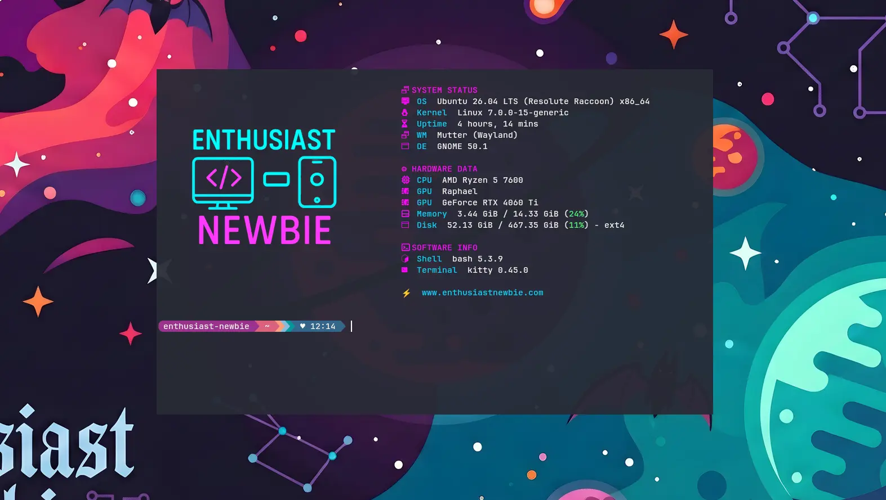

# Newbie_shell (il mio terminale personalizzato)

Se siete nuovi su Linux l'impatto iniziale con il terminale può essere traumatico. Spesso sembra un reperto archeologico degli anni '80, freddo e intimidatorio. 

Ma la verità è un'altra: personalizzare il proprio terminale non è solo un vezzo estetico. Renderlo moderno, accattivante e ottimizzato per il proprio flusso di lavoro è il modo migliore per superare la paura della riga di comando, essere più produttivi e iniziare a esplorare il mondo Linux con vero divertimento. 

In questa guida passo dopo passo (ispirata all'ultimo video sul mio [canale YouTube @EnthusiastNewbie](https://youtube.com/@enthusiastnewbie)) vedremo come trasformare completamente la nostra shell usando tre tools:

> 🐱 **Kitty** (il terminale) • 🚀 **Starship** (il prompt) • ⚡ **Fastfetch** (l'identità di sistema)




---

## Capire le Basi: Cos'è davvero un Terminale?

Prima di sporcarci le mani con file di configurazione e comandi, facciamo un po' di chiarezza della teoria per principianti. Molti fanno confusione tra terminale e shell. 

* **Terminal Emulator (Emulatore di Terminale):** È il software grafico che aprite sul vostro desktop (come il Terminale di default della vostra Distro, o Kitty). Storicamente, esistevano le **TTY (Teletypewriter)**, ovvero dispositivi hardware fisici che inviavano input testuale a un mainframe centrale. Oggi, un software emula quell'hardware classico direttamente sul nostro monitor. Il suo compito principale è gestire tre canali fondamentali chiamati **Standard Streams**:
    * **Standard Input (stdin):** I dati che inviate digitando direttamente dalla vostra tastiera.
    * **Standard Output (stdout):** I dati corretti che il sistema elabora e vi restituisce visualizzandoli a schermo.
    * **Standard Error (stderr):** Il canale indipendente dedicato esclusivamente ai messaggi di errore, fondamentale per capire cosa è andato storto.
* **La Shell:** È l'interprete dei comandi vero e proprio (come **Bash** o **Zsh**). Agisce da intermediario prendendo il testo che digitate nel Terminal Emulator e traducendolo in istruzioni per il **Kernel** del sistema operativo.

Capire questo meccanismo è importante perché oggi andremo a modificare sia l'involucro grafico (Kitty) sia l'aspetto visivo delle risposte della shell (Starship).

---

## 1. Installare Kitty 

Perché abbandonare il terminale predefinito della vostra distribuzione? La risposta è semplice: **prestazioni ed estensione**.

[Kitty](https://sw.kovidgoyal.net/kitty/) è un emulatore di terminale moderno che delega il rendering del testo alla vostra scheda video (**GPU**). Questo significa uno scorrimento del testo incredibilmente fluido, la possibilità di visualizzare nativamente immagini o animazioni complesse e una reattività che i comuni emulatori non hanno. Inoltre, l'intera configurazione si gestisce tramite un semplicissimo file di testo.

### Opzioni di Installazione

Se volete l'ultimissima versione stabile dal sito ufficiale (fortemente consigliato per avere tutte le funzionalità grafiche più recenti), potete usare lo script ufficiale e seguire la guida per integrarlo nel vostro sistema:

```bash
curl -L https://sw.kovidgoyal.net/kitty/installer.sh | sh
```

Se invece preferite installarlo direttamente dai repository della vostra distribuzione (anche se probabilmente non sarà l'ultimissima release disponibile), eseguite il classico comando di gestione pacchetti:

**Su Debian/Ubuntu:**
```bash
sudo apt update && sudo apt install kitty -y
```

Al primo avvio Kitty vi sembrerà estremamente minimale, quasi spoglio. Non preoccupatevi, in pochi passaggi lo renderemo decisamente più accattivante.

---

### Scegliere il Tema

Kitty include uno strumento nativo eccezionale per sfogliare e scegliere i temi. Esegui il comando:

```bash
kitten themes
```

Si aprirà un'interfaccia interattiva direttamente nel terminale. Potete scorrere la lista per cercare lo schema di colori che si avvicina di più al vostro tema di sistema.

> 🦇 **La mia scelta:** Nel mio setup su Ubuntu con ambiente grafico GNOME mi affido da sempre al tema **Dracula**, una palette colori scura, accattivante e inclusa già di default nei temi di Kitty. Selezionatela e premete Invio per applicarla.

---

### Configurazione di Kitty

Il file principale di configurazione di Kitty si trova nel percorso: `~/.config/kitty/kitty.conf`.

Edito il file con l'editor di testo da terminale `nano`:

```bash
nano ~/.config/kitty/kitty.conf
```

Ecco le modifiche principali che ho inserito nel mio file per renderlo moderno e pulito (ricordati di decommentare le righe rimuovendo il cancelletto `#` se necessario):

```conf
# Nascondo i bordi e le decorazioni della finestra per un look minimale
hide_window_decorations yes

# Imposto una leggera trasparenza dello sfondo
background_opacity 0.95

# Aggiungo un effetto sfocatura (blur) alla trasparenza
background_blur 30
```

Per salvare le modifiche in Nano premi **Ctrl + O** e poi **Invio**, mentre per chiudere l'editor usa **Ctrl + X**.

💡 **Tip:** Avendo nascosto delle decorazioni della finestra (`hide_window_decorations yes`), non ci saranno più i classici tasti per trascinare o ridimensionare il terminale con il mouse. Potete comunque spostare la finestra tenendo premuto il tasto **Super** (il tasto Windows, o il tasto Alt a seconda della mappatura del vostro sistema) e trascinandola. In alternativa, tenendo premuto il tasto Super, potete cliccare con il pulsante destro del mouse sul terminale per far apparire il menu contestuale, utile ad esempio per ridimensionare la finestra.

Se volete una panoramica completa di tutte le opzioni modificabili in Kitty, date un'occhiata alla sezione [kitty.conf sul sito ufficiale](https://sw.kovidgoyal.net/kitty/conf/), dove è presente una carrellata di opzioni molto ben commentata.

---

## 2. Impostare Kitty come Terminale di Default

Per aprire rapidamente Kitty con la classica combinazione di tasti Linux **Ctrl + Alt + T**:

1. Aprite le impostazioni delle scorciatoie da tastiera del vostro Desktop Environment (GNOME, KDE, XFCE…).
2. Create una nuova scorciatoia personalizzata:
   * **Nome:** `Kitty Terminal`
   * **Comando:** `kitty`
   * **Scorciatoia:** `Ctrl+Alt+K`
3. Salvate le modifiche.

---

## 3. Installare Starship Prompt

[Starship](https://starship.rs/) è il componente che andrà a personalizzare il prompt, ovvero quella breve riga di testo che indica che il sistema è pronto a ricevere un comando. È un prompt moderno velocissimo e altamente personalizzabile.

### ⚠️ Installare prima un Nerd Font!
Avete mai visto dei quadratini brutti al posto delle icone? Succede perché il vostro font attuale non "conosce" qualche simbolo particolare. La soluzione è scaricare un font nerd che contiene tutti i vari simboli che vogliamo far comparire sul nostro terminale.

1. Andate sul sito ufficiale [nerdfonts.com](https://www.nerdfonts.com/font-downloads).
2. Scaricate ad esempio il mio preferito: **JetBrainsMono Nerd Font**.
3. Estraete l'archivio scaricato e copiate tutti i file dei font nel percorso utente:
   ```bash
   mkdir -p ~/.local/share/fonts
   cp *.ttf ~/.local/share/fonts/
   ```
4. Aggiornate la cache dei font del sistema lanciando il comando:
   ```bash
   fc-cache -fv
   ```
5. Andate nelle impostazioni del vostro sistema operativo e impostatelo come font monospaziato predefinito.
6. Infine, aprite Kitty e selezionatelo esplicitamente con lo strumento dedicato:
   ```bash
   kitten choose-fonts
   ```

### Installazione di Starship

Ora che il sistema è pronto a visualizzare correttamente i simboli, possiamo installare Starship:

```bash
sudo apt install starship
```

Dobbiamo poi dire alla nostra shell (di solito Bash) di avviare Starship ogni volta che apriamo il terminale. Aprite il file `.bashrc`:

```bash
nano ~/.bashrc
```

Scorrete fino in fondo alla pagina e aggiungete questa riga:

```bash
eval "$(starship init bash)"
```

Salvate (**Ctrl+O**, poi **Ctrl+X**).

### Applicare il Preset Grafico
Potete scegliere dei preset (ovvero dei temi già pronti) andando sulla sezione dedicata del sito ufficiale di Starship. Nel mio setup ho scelto il preset **Pastel Powerline**, che crea delle bellissime frecce colorate e continue per separare i segmenti del percorso.

Per applicare istantaneamente il preset scelto, incollate questo comando nel terminale:

```bash
starship preset pastel-powerline -o ~/.config/starship.toml
```

Riavviate il terminale per vedere il prompt trasformato.

---

## 4. Installare e Personalizzare Fastfetch

[Fastfetch](https://github.com/fastfetch-cli/fastfetch) è il tool moderno e ultra-veloce che mostra il riepilogo delle informazioni di sistema con un look elegante. 

### Installazione
Installatelo direttamente dai repository ufficiali della vostra distribuzione:

```bash
sudo apt install fastfetch -y
```

Per farlo apparire automaticamente all'avvio di ogni sessione, aprite nuovamente il file `~/.bashrc` con nano e scrivete semplicemente `fastfetch` come ultimissima riga in fondo al file.

### La personalizzazione di Enthusiast Newbie (Con Immagine nel Terminale)
In giro sul web si trovano migliaia di file di configurazione già pronti. Grazie a Kitty, possiamo addirittura inserire delle immagini reali nel terminale sfruttando fastfetch al posto della classica ASCII art!

In questo stesso repository GitHub ho preparato per voi due file: `config.jsonc` e `logo.png`.

#### Come procedere:
1. Scaricate i file `logo.png` (il logo del nostro brand) e `config.jsonc` usando il pulsante download nella pagina in alto a destra di ciascun file.
2. Create la cartella di configurazione di Fastfetch (se non esiste) e copiateci dentro i file:
   ```bash
   mkdir -p ~/.config/fastfetch/
   cp config.jsonc logo.png ~/.config/fastfetch/
   ```
3. **Attenzione:** Aprite subito il file `config.jsonc` appena copiato:
   ```bash
   nano ~/.config/fastfetch/config.jsonc
   ```
   Assicuratevi che la riga `"source": "/home/vostro_utente/.config/fastfetch/logo.png"` punti al vostro **reale nome utente** corretto del sistema, altrimenti Fastfetch fallirà l'avvio non trovando l'immagine.

#### Struttura del mio file config.jsonc:
Ho diviso le informazioni sul sistema in 3 comodi blocchi logici modificabili:
* 📊 **SYSTEM STATUS:** Vi mostra i dati vitali come OS, versione del Kernel Linux in uso e l'Uptime.
* 💻 **HARDWARE DATA:** Monitora la componentistica fisica, indicando CPU, GPU e l'utilizzo corrente della RAM.
* 💾 **SOFTWARE INFO:** Indica quale specifico Terminal Emulator e quale Shell state usando per i comandi.

In fondo, ho aggiunto anche un link testuale diretto al mio sito: `www.enthusiastnewbie.com`. Ovviamente potete cambiare intestazioni, colori e moduli semplicemente editando questo file di testo.

---

## 💡 Bonus Tip: Gli Alias di Bash

Un'altra cosa molto utile che possiamo fare mentre abbiamo aperto il file `.bashrc` è aggiungere un **alias**, ovvero una scorciatoia personalizzata per eseguire comandi lunghi o ripetitivi.

Aprite il file:
```bash
nano ~/.bashrc
```

Incollate in fondo una riga come questa:
```bash
alias aggiorna='sudo apt update && sudo apt upgrade -y'
```

Dopo aver salvato, vi basterà dare semplicemente il comando `aggiorna` nel terminale per aggiornare automaticamente l'elenco dei pacchetti disponibili e applicare tutti gli aggiornamenti di sistema.

---

##  Enthusiast_Newbie
Segui i miei esperimenti:
* **YouTube:** [@enthusiastnewbie](https://youtube.com/@enthusiastnewbie)
* **Sito Web:** [enthusiastnewbie.com](https://enthusiastnewbie.com)
* **Social:** Instagram, TikTok, Facebook, Mastodon

---
