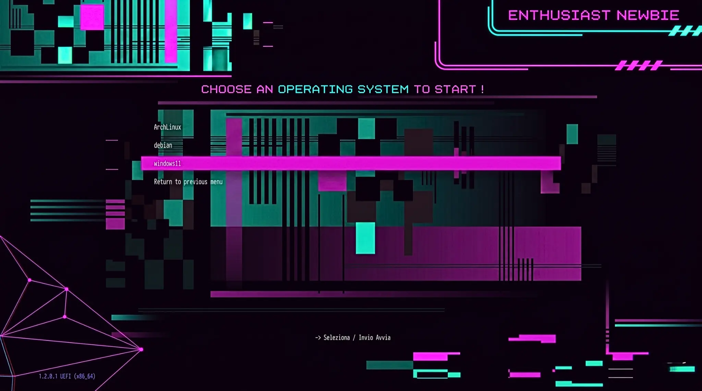

<div align="center">
  <h1 style="color: #00ffff;">🎨 Newbie_Grub</h1>
  <p><i>"Tema Minimale per IL BootLoader GRUB."</i></p>
</div>

---



## Caratteristiche
- **Layout:** Menu centrato verticalmente e orizzontalmente.
- **Colori:** Testo bianco, selezione Magenta Neon (`#ff00ff`).


## Installazione 

1. Copia la cartella `newbie_grub` nel percorso dei temi di GRUB:
   ```bash
   sudo cp -r newbie_grub /boot/grub/themes/
   ```
2. Modifica il file di configurazione di GRUB:
   ```bash
   sudo nano /etc/default/grub
   ```
3. Aggiungi o modifica la riga del tema:
   ```text
   GRUB_THEME="/boot/grub/themes/newbie_grub/theme.txt"
   ```
4. Aggiorna GRUB (su Arch Linux):
   ```bash
   sudo grub-mkconfig -o /boot/grub/grub.cfg
   ```

## Utilizzo con Ventoy

1. Crea una cartella `ventoy` nella root della tua chiavetta USB.
2. Copia la cartella `newbie_grub` in `/ventoy/themes/`.
3. Crea o modifica il file `/ventoy/ventoy.json`:

```json
{
    "theme": {
        "file": "/ventoy/themes/newbie_grub/theme.txt",
        "gfxmode": "1920x1080",
        "display_mode": "gui"
    }
}
```

## Generazione Asset 

Il file `select_s.png` (l'effetto SELEZIONE) è stato generato tramite ImageMagick:

```magick -size 800x40 canvas:none \
    -fill "#ff00ff66" -draw "roundrectangle 2,2 798,38 8,8" \
    -filter Gaussian -blur 0x3 \
    select_s.png
```

---

### Disclaimer
Tutto il codice qui è scritto da un semplice Newbie appassionato, in fase di apprendimento.

---

## Enthusiast_Newbie
Segui i miei esperimenti:
* **YouTube:** [@enthusiastnewbie](https://youtube.com/@enthusiastnewbie)
* **Sito Web:** [enthusiastnewbie.com](https://enthusiastnewbie.com)
* **Social:** Instagram, TikTok, Facebook, Mastodon

---
