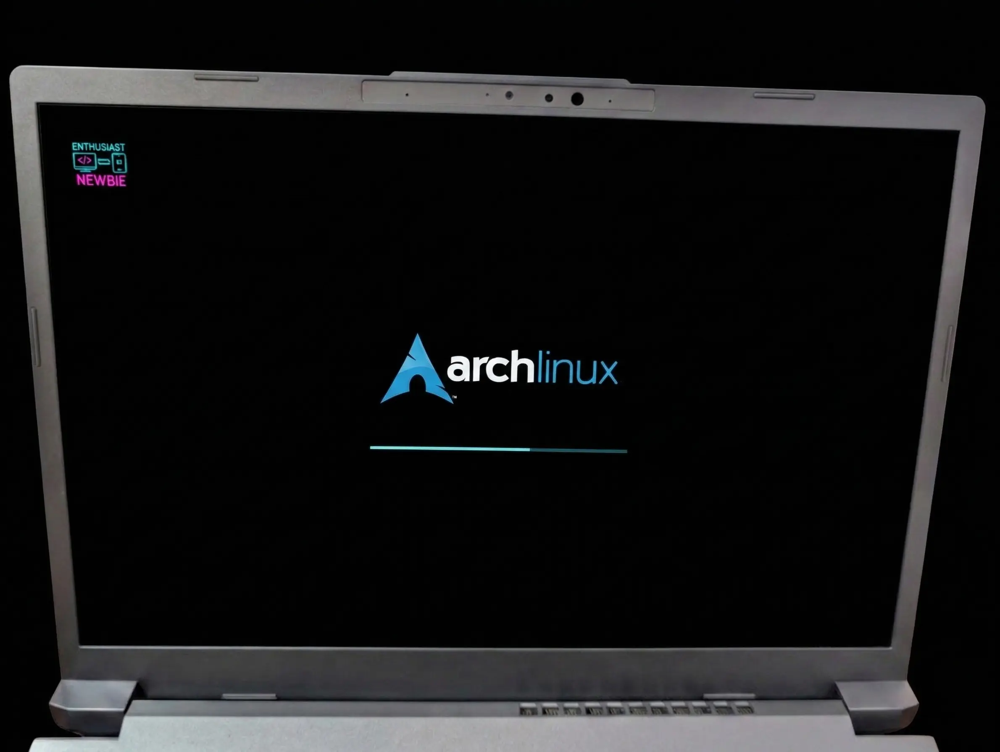

<div align="center">
  <h1 style="color: #00ffff;">🎨 Plymouth Newbie Theme (Arch Edition)</h1>
  <p><i>"Tema ArchLinux per Plymouth."</i></p>
</div>

---

### Cos'è?
**Plymouth Newbie** Invece della cascata di Log e messaggi del Kernel, Grazie a plymouth e a questo tema, mostriamo il leggendario logo di Arch al centro accompagnato da una barra di progresso minimale.
Nonostante Arch sia una distro "minimalista", non dobbiamo rinunciare a un'estetica curata fin dal primo secondo dopo l'accensione :) 



---

### 🛠️ Come si installa su Arch Linux?

Installare Plymouth su Arch :

#### 1. Installazione del pacchetto
Per prima cosa, installiamo Plymouth da AUR:
```bash
sudo yay -S plymouth
```

#### 2. Copia dei file del tema
Scarica la cartella del tema e Sposta la cartella del tema `plymouth_newbie` nella directory corretta di sistema:
```bash
sudo cp -r ../plymouth_newbie /usr/share/plymouth/themes/
```

#### 3. Configurazione dei Hooks di mkinitcpio
Affinché Plymouth parta il prima possibile, devi aggiungerlo ai "hooks". 
Apri `/etc/mkinitcpio.conf` e cerca la riga `HOOKS=`. Aggiungi `plymouth` **subito dopo** `systemd`:
```bash
HOOKS=(base systemd plymouth autodetect modconf block filesystems keyboard fsck)
```

#### 4. Impostazione del tema e Rigenerazione
Usa il comando di Plymouth per selezionare il nuovo tema e rigenerare l'immagine initramfs:
```bash
sudo plymouth-set-default-theme -R plymouth_newbie
```

#### 5. Parametri del Bootloader
Devi istruire il kernel a mostrare lo splash screen. Modifica la configurazione del tuo bootloader (es. `/etc/default/grub`) aggiungendo questi parametri alla riga di avvio:
`quiet splash vt.global_cursor_default=0`

---

### 🤫 L'obiettivo finale: Silent Boot
Per un'esperienza davvero pulita, il tema Plymouth deve apparire dal nulla su uno sfondo completamente nero, senza scritte di sistema o cursori lampeggianti. 

Per configurare Arch in modo che non mostri alcun messaggio durante l'avvio, segui la guida ufficiale:
📖 **[ArchWiki - Silent boot](https://wiki.archlinux.org/title/Silent_boot)**

Ti consiglio caldamente di leggere la sezione sui parametri del kernel `loglevel=3` e `rd.systemd.show_status=auto` per nascondere i messaggi di systemd.

---

### 🎨 Personalizzazione e Modifiche

#### Cambiare il Logo Personale
Il logo in alto a sinistra è definito nel file `plymouth_newbie.script`. 
* Sostituisci il file `newbie_logo.jpg` nella cartella con un'altra immagine.
* [**Nota tecnica:** Se usi un formato diverso (es. `.png`), apri il file `.script` e aggiorna la riga che carica l'immagine:
  `newbie_logo_raw = Image("tuo_logo.png");`

#### Spostamento Elementi
* **Logo Centrale:** Nel file `.script`, la posizione è gestita dalla funzione `SetPosition` .  Il valore `- 65` serve a sollevare il logo per fare spazio alla barra di caricamento.
* **Barra di caricamento:** La barra è posizionata esattamente 20 pixel sotto il logo centrale . Puoi modificare la variabile `b_y` per regolare la distanza.

---

### ⚠️ Disclaimer
Tutto il codice qui è scritto da un semplice Newbie appassionato, in fase di apprendimento.

---

##  Enthusiast_Newbie
Segui i miei esperimenti:
* **YouTube:** [@enthusiastnewbie](https://youtube.com/@enthusiastnewbie)
* **Sito Web:** [enthusiastnewbie.com](https://enthusiastnewbie.com)
* **Social:** Instagram, TikTok, Facebook, Mastodon

---
